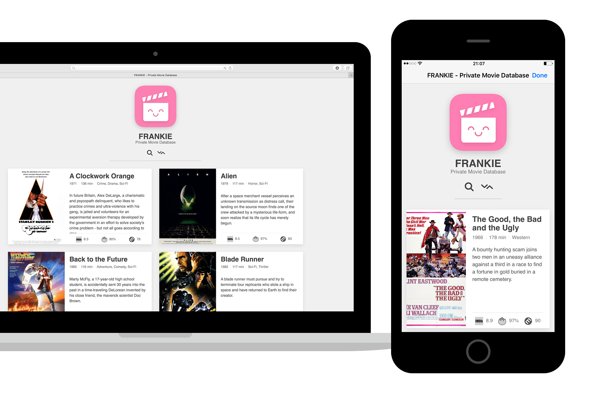

# Frankie
### Your private movie database in Workflow.app

Frankie is a set of workflows for Workflow.app to create, maintain and display a webapp with your private movie database right on your iOS device.

[Live version](https://cdn.rawgit.com/melangue/Frankie/649d50e8/demo/frankie.html)

## Features
* 'Written' fully in [Workflow.app](https://itunes.apple.com/app/workflow-powerful-automation/id915249334)
* 5 Workflows to create, maintain and view your private movie database
* Movie information from [OMDb](http://omdbapi.com) API, including hi-res movie posters
* Movie scores from 3 popular ranking sites - [IMDb](http://www.imdb.com/), [Rotten Tomatoes](https://www.rottentomatoes.com/) and [Metacritic](http://www.metacritic.com/) (tap on the icons to get more info from each)
* Movie trailers from [YouTube](https://www.youtube.com/) - click/tap on the movie's poster to watch it's trailer
* Search and sort your movies by title, year, average score, movie duration and date added - [List.js](http://listjs.com) integration
* Responsive flexbox grid layout which adapts to your screen size and ratio
* Inlined CSS and JS - one file output
* Cute icon!

## Usage
Assuming you've got [Workflow.app](https://itunes.apple.com/app/workflow-powerful-automation/id915249334) installed on your iOS device just download and install all of the workflows present in this repo.

Use `Frankie Adds` or `Frankie Adds Multi` to add movies and `Frankie Removes` to delete them.

View Frankie by running `Frankie`.  
I would recommend adding this workflow to your homescreen for easier access, use Frankie's icon which you can download from this repo.  
To view Frankie on your Macbook just view and bookmark it in your browser - Frankie was tested on on mobile/desktop Safari and Google Chrome.

Frankie uses your iCloud Drive for file storage.  
It creates and uses only 2 files stored directly in the `/Workflow/` folder:
* `frankie_db.txt` - plain `txt` file which stores movie information gathered by `Frankie Adds`
* `frankie.html` - static `html` file created by `Frankie Generates` - this is the webapp part

## Frankie's workflows
### Frankie Adds
This workflow prompts you for a movie name, looks for possible matches on [IMDb](http://www.imdb.com/) and asks you to choose the correct one from a list, usually the first one.
After confirming with you it grabs all the necessary info about the movie from [OMDb](http://omdbapi.com) and prepends it to `frankie_db.txt`.

### Frankie Adds Multi
This is a simplified version of `Frankie Adds`.
It prompts you for a plain text file with movie titles, separated by newlines.
Then it runs the `Frankie Adds` workflow on each movie with one **serious** exception - it automatically chooses first matched title from [iMDB](http://www.imdb.com) instead of showing you a list of possible matches.  
This greatly speeds up the whole process but may result in wrong movie getting matched.
In my testing the margin of error was below 5% so unless you watch some really exotic movies then you should be golden.
It takes around 2 minutes to go through a list of 35 movies.

### Frankie Removes
This workflow is used to delete movies from Frankie's database - `frankie_db.txt`.  
You can either select movie titles from a list or specify a movie name yourself.  
Select one (or more) titles which will be deleted from Frankie's database.

### Frankie Generates
This workflow generates the webapp part - `frankie.html`.  
It reads `frankie_db.txt` and thanks to some wonky regex magic it converts each movie's info back to variables so they can be used to populate the movie cards.  
The layout is split into partials which makes it easy to maintain - all of the HTML structure can be edited right in this workflow.

Note - You don't need to run this workflow manually, it runs automatically at the end of both `Frankie Adds` or `Frankie Removes`.

### Frankie
This workflow's one and only purpose is to display Frankie locally on your iOS device - it basically opens `frankie.html` in Safari View Controller.

Note - Even though Frankie works locally on your device it needs internet connection to display movie posters.

# More info
### Why "Frankie"?
This one is easy - he's kinda [frankensteined](https://media.giphy.com/media/S9C2vmzuK0dRm/giphy.gif) together (but still cute!).

My girlfriend and I watch a lot of movies and it's hard to keep track of all of them, we always end up looking up each one iMDB which takes a lot of fun out of picking a movie for the evening.  
Altough there are some services which offer this kind of functionality (like [Letterboxd](https://letterboxd.com/) for example) I thought it would be a fun challenge to create one by myself.
I got the idea about creating it entirely in [Workflow.app](https://itunes.apple.com/app/workflow-powerful-automation/id915249334) after looking through various workflows on the internet.

### The process
[Bam](https://media.giphy.com/media/ZQjUvxPYUQ21q/giphy.gif)! Frankie enters the scene and solves all my problems like the modest hero he is.  

It took me a lot of trial and error to make Frankie work as I initially imagined.  
Frankie uses a lost of [regular expressions](https://en.wikipedia.org/wiki/Regular_expression) to do what it does.  
Most of them are pretty basic and some could be done better but prior to creating Frankie I knew nothing about regex so you will have to forgive me.  
I think storing data in JSON would be a better idea, maybe even a bit faster to process but I'm nowhere near knowledgeable enough to pull it off.

All in all I've had a lot of fun when creating Frankie.  
If you would like to view the 'source' code which is split into partials in `Frankie Generates` workflow you can check the code in `/source/` found in this repo but fair warning - there is some questionable code in there.

I did not write all of the Frankie's workflows from scratch.  
I've completely gutted/modified/possibly upgraded following workflows for it's purposes:
* [Static Site Generator](https://workflow.directory/workflows/static-site-generator/) by [Jordan Merrick](https://www.jordanmerrick.com/)
* [Movie Diary Plus](https://onetapless.com/actions/workflow/movie-diary-plus) by [Phillip Gruneich](https://onetapless.com) - not an original version, I used one which was already modified by some [redditors](https://www.reddit.com/r/workflow/comments/4no6lb/bug_movie_to_day_one_workflow_no_longer_working/).

### Resources used
* Frankie's icon is made by me using icons from [The Noun Project](https://thenounproject.com/):
  - Frankie's clapperboard body by [LinseedStudio](https://thenounproject.com/term/clapperboard/653910/)
  - Frankie's smile by [Carlos Gonzalez](https://thenounproject.com/term/happy-mask/859163/).
* [IMDb](http://www.imdb.com/), [Rotten Tomatoes](https://www.rottentomatoes.com/) and [Metacritic](http://www.metacritic.com/) logos - SVG versions from [Wikipedia Commons](https://commons.wikimedia.org/) - edited by me to fit with Frankie's style.
* [Youtube](https://www.youtube.com/) logo - by [Hadrien](http://www.flaticon.com/authors/hadrien) - found on [Flaticon.com](http://www.flaticon.com).
* [List.js](http://listjs.com) - by [Jonny Strömberg](https://github.com/javve)
* [Normalize.css](https://github.com/necolas/normalize.css) - by [Nicolas Gallagher](https://github.com/necolas/)
